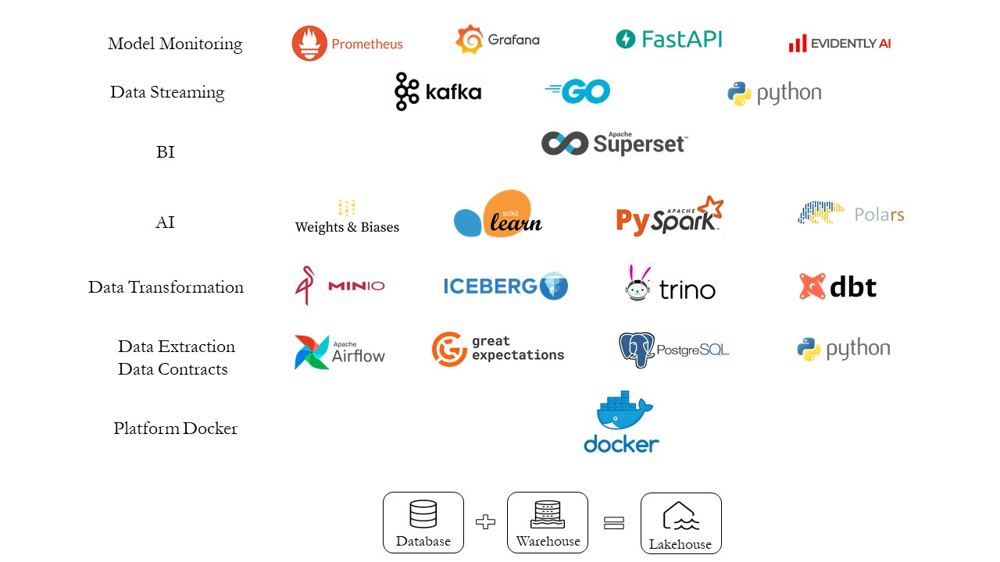

# Magnum Opus

**Magnum Opus** is my "Magnum Opus". This work combines my knowledge of software engineering and data science. In this project, I am putting a good number of languages and technologies together to demonstrate my mastery over all those items. 

This project simulates a data science pipeline that handles a stream of data, processes it, and show prediction in a dashboard. To elaborate on this, the following list might help in understanding the pipeline:

**Data Pipeline**

* Dataset: Current plan to use a text-based dataset that can be clustered into multiple categories. Dataset will be version controlled using DVC.
* Data Source: I plan to simulate a Twitter-like environment, where data comes in batches and there is a blockage for some time between two subsequent requests. To realize this idea, I plan to employ an AWS Lambda function that will be connected to a DynamoDb and and S3-Bucket. It will read the last-read-record from DynamoDb and send the next batch after the blockade is clear. Such a functionality can be simulated through LocalStack, without incurring any financial loss. In addition to this, I shall also use Terraform to simulate the automation process using Infrastructure-as-Code.
* Kafka: As always, a Kafka module is essential for most of the stream-processing (batch) system. I plan to use this. Here, there will be two producers and consumers written in Golang. The producer shall communicate with the Lambda and get the data and the consumer shall communicate with a service that serves the model.
* Data Quality: Data quality is a big idea for this project. This shall be ensured through Kafka Schema Registry, Apache Griffin(Java), Great Expectation (Python) etc. Schema evolution, data drift, concept drift, column validation, etc. are some of the items that will be validated here.
* Model Serving: Model serving will be done through a REST-API, built using FastAPI. This API will maintain a WebSocket with the dashboard.
* Spark-Streaming: A PySpark model shall be served using spark-streaming, thus reducing the need for an extra consumer of Kafka. 
* Dashboard: Streamlit will be used to create a live dashboard. Here, I shall show the result of the classification in a live manner through WebSocket. A second portion will show the result of the spark-streaming model. I might also use micro-front-end architecture for developing the dashboard. 
Or, alternatively, the UI can be built using Angular. This will provide more support. I can use multiple sections using micro-frontend architecture: each section will talk to a different microservice. There can be a separate section to show some exploratory data about the train split of the dataset. What kind of information will be shown is a question, but some basic stuff, like class distribution, etc. can be shown. For this, i can use pyodide and wasm functionality. 
See more: https://testdriven.io/blog/build-spa-with-python-part-2/
https://boyan.io/angular-wasm/

**Machine Learning Modelling**
As this will be a clustering dataset, I plan to use multiple mdoels. These models will be trained in different ways as well. 
* Sci-Kit Learn: Traditional machine learning model will be used through sci-kit learn. PyCaret, MLFlow will be used for model and hyper-parameter selection. 
* PySpark: A model will be developed PySpark. This model will be served through Spark-Steaming. 
* PyTorch: A deep learning model will be developed through PyTorch. This model will be trained using and tuned through KubeFlow. 

**DevOps**
* Circle-CI/GitHub Works: Either can be used as a CI tool for this project.

**Kubernetes**
* K8S: The whole project will be deployed in Kubernetes. 
* Helm: Helm packing shall be used here.
* Istio: Istio shall be used for better control over the traffic.
* Jaegar: Distributed tracing. 
* ELK: for log aggregation.
* Gatling: for load testing.

## Workplan
The whole project is divided into multiple modules. 
* Lambda module
* Kafka module
* .....

## Languages of this project
Python, NodeJS, Java, Golang, HCL.
