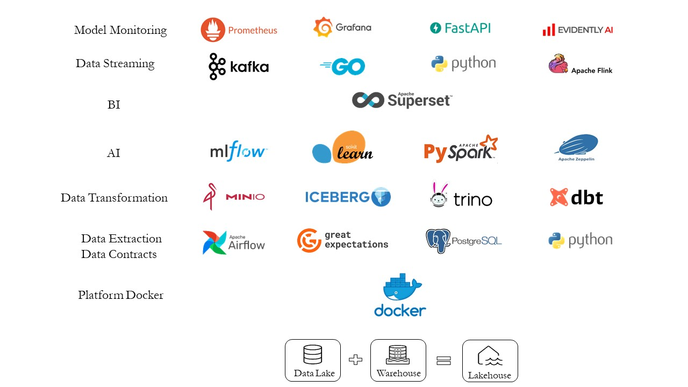

# Magnum Opus

**Magnum Opus** is my "Magnum Opus". This work combines my knowledge of software engineering and data science. In this project, I am putting a good number of languages and technologies together to demonstrate my mastery over all those items. 

This project simulates a data science pipeline. In this pipeline we are faced with the challenge of scraping popular NYC Taxi and Limousine Dataset. Then we must process and store this dataset in order to use them in downstream task like machine learning modeling or dashboard creation for business intelligence. Furthermore, we must also develop ML model using ML pipeline (feature selection, feature engineering, model selection, hyperparam tuning, etc.). In addition to this, we must also deploy the developed model to handle a streaming a scenario. 

So, in simple terms, this project will go through the full cycle of a machile learning engineering workload, from ETL to ML development to MLOps in streaming mode. The following image will give you an idea of what technologies will be used in this project. 

Let's now enumerate some of the characteristics of this project:

* A great many technologies are being used here. This shows my understanding and mastery over these technologies and their synergy to build a fully functional pipeline.
* All the technologies that are used are either free or open-source or both. So, anyone who wants to use it, they can.
* This project is being run completely on-premise without incurring any additional cost apart from electricity and carbon cost.
* There are only a handful of projects in GitHub that goes to the extent this project will go. So, this could work as a good starting point for the people who wants to get to know these technologies the hard way.
* There are very few examples online where the concept of data lakehouse has been materialized in this way (on-prem, open-source, full-cycle).

As the image suggest, this project will have several components. As this is still under development, you might see occassional changes in this file. Currently, the ETL pipeline is complete. The detailed concept of this ETL pipeline can be found in the ETL README file. 

**Data Pipeline**

* Dataset: Current plan to use the [NYC TLC Dataset](https://www.nyc.gov/site/tlc/about/tlc-trip-record-data.page).
* ETL: The data will be extracted from the aforementioned source. Then the scraped data will go through a data quality pipeline where data schema will be tested via [Pandera](https://pandera.readthedocs.io/en/stable/). A good number of unit testing on the properties of data will also be conducted with [Great Expectations](https://greatexpectations.io/). Then the data will be pushed to a [PostgreSQL](https://www.postgresql.org/) database. Then three different [dbt](https://www.getdbt.com/) projects will be used to implement [SCD](https://en.wikipedia.org/wiki/Slowly_changing_dimension) in order to create a [Lakehouse](https://www.databricks.com/glossary/data-lakehouse) like architecture with Bronze, Silver, and Gold layer with appropo business logic in each of them. This whole system will be orchestrated using [Apache Airflow](https://airflow.apache.org/). The lakehouse will be created with [MinIo](https://min.io/) and [Apache Iceberg](https://iceberg.apache.org/). To facilitate this platform [Trino](https://trino.io/) and [Hive](https://hive.apache.org/) (for meta-store) is also being used. 

* Model Development: Models will be developed using Python. As we have created separate data for the AI part, this data will be accessed via [Trino](https://trino.io/) and [Apache Spark](https://spark.apache.org/). To facilitate this interaction, [Apache Zeppelin](https://zeppelin.apache.org/) will be used as the notebook platform. In addition to this, to track the hyper-parameter tuning and model training [MLFlow](https://mlflow.org/) will be used  along with [MinIo](https://min.io/) as object storage.  

* Model Deployment: Developed ML model will be deployed with [FastAPI](https://fastapi.tiangolo.com/). This will have the backing of [Evidently AI](https://www.evidentlyai.com/) for detecting data and prediction drift in the deployed model. This also requires setting up [MongoDB](https://www.mongodb.com/), [Grafana](https://grafana.com/), and [Prometheus](https://prometheus.io/). This Prometheus will also extract system metrics from [Docker](https://www.docker.com/).

* Streaming: Data streaming is also a target of this project. This will be done with [Apache Kafka](https://kafka.apache.org/) and [Golang](https://go.dev/). In addition to this, there will be a stateful component of this streaming platform which will be created using [Apache Flink](https://flink.apache.org/). Result of this Flink windowing policy and model prediction will be visualized using [Streamlit](https://streamlit.io/). This streaming platform needs orchestration which will be done with [Prefect](https://www.prefect.io/).

## Languages of this project
Python, Java, Golang.