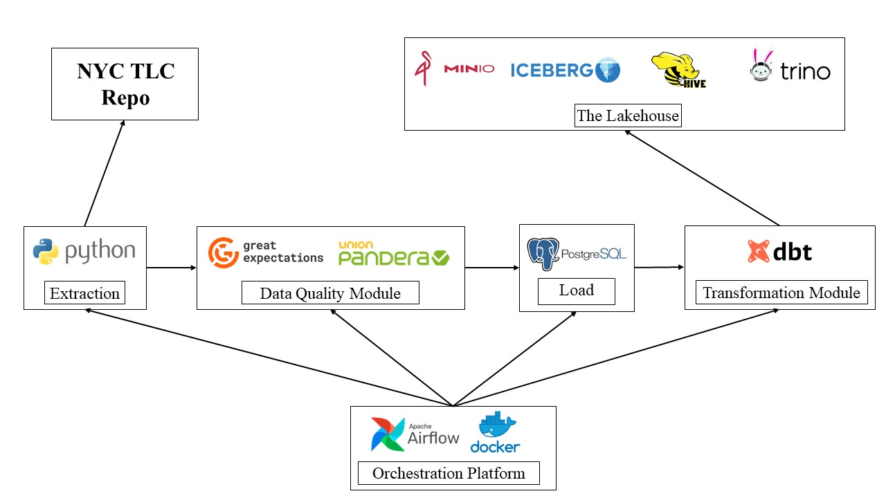

# Lakehouse ELT (ETL) Architecture of Magnum Opus

As is apparent from the image above, this part of the project implements a ELT pipeline based on the idea of [Lakehouse](https://www.cidrdb.org/cidr2021/papers/cidr2021_paper17.pdf). But, instead of relying on the click-based hosted solutions, I went for a full-ride on getting things done in a hard way. I created my own lakehouse based on open-source and free tools. For this, I am heavily relying on [MinIo](https://min.io/) and [Apache Iceberg](https://iceberg.apache.org/). To facilitate this platform [Trino](https://trino.io/) and [Hive](https://hive.apache.org/) (for meta-store). 

[MinIo](https://min.io/), in this case, is our storage device where we are storing our structured data. To bring SQL capabilities to this data, I am using [Apache Iceberg](https://iceberg.apache.org/). [Trino](https://trino.io/) and [Hive](https://hive.apache.org/) are being used for accessing this lakehouse. 

Initially the data is getting pulled from the source using simple scraper built using Python. This NYC TLC dataset has many different fieids and I want to make sure these fields have the compatible types and appropriate values. So, I created a Data Quality module. There are some online resources about what a data quality module should look like, but I could not find any standards or packages for implementing it. So, my data quality module is built with the ideas I found important for this project. Here, [Pandera](https://pandera.readthedocs.io/en/stable/) is used for schema validation and [Great Expectations](https://greatexpectations.io/) is used to perform unit testing on the individual columns of the data. This sufficiently ensures the quality of the scraped data. 

As suggested by the original authors of [Lakehouse](https://www.cidrdb.org/cidr2021/papers/cidr2021_paper17.pdf) paper, my lakehouse has three levels: Bronze, Silver, and Gold. To implement this concept, I [dbt](https://www.getdbt.com/) extensively. The scraped and validated data is pushed to a [PostgreSQL](https://www.postgresql.org/) database first. Then dbt loads the data through [Trino](https://trino.io/) and slowly transforms it into a usable format. This transformation happens in three stages: in the bronze layer, raw data is loaded from PostgreSQL. Then in the silver layer, I filter the data and select only the valid ones. In the gold layer, the data is divided into AI and BI compatible format. For the BI, I have added additional columns that might become useful for analytics. 

Finally, these transformed layers are getting stored in the lakehouse with the help of [Trino](https://trino.io/). The raw data is being stored in a [MinIo](https://min.io/) storage in the [Apache Iceberg](https://iceberg.apache.org/) format. Thus, when I use [DBeaver](https://dbeaver.io/) to communicate with my lakehouse, I can query on each of the layer separately. 

To accomplish this whole feat, I have leaned on several free and open-source resources. Here is a non-exhaustive list of resources I found useful:

1. https://medium.com/@ongxuanhong/dataops-03-trino-dbt-spark-everything-everywhere-all-at-once-241932d27a6
2. https://github.com/zsvoboda/ngods-stocks
3. https://www.starburst.io/blog/2022-11-30-dbt0-introduction-html/
4. https://www.youtube.com/playlist?list=PL3MmuxUbc_hJed7dXYoJw8DoCuVHhGEQb